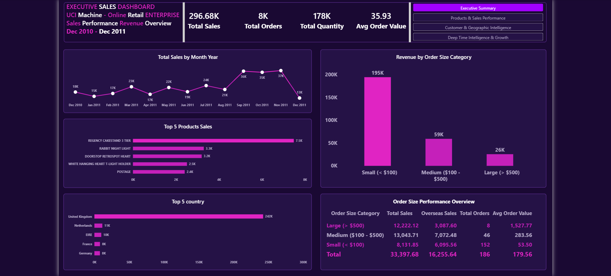
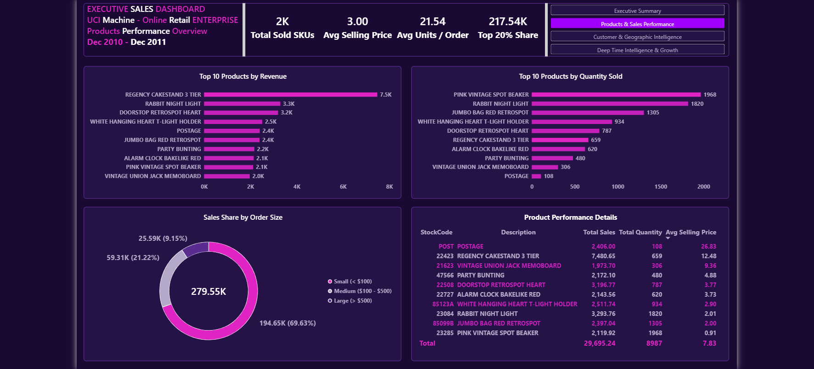
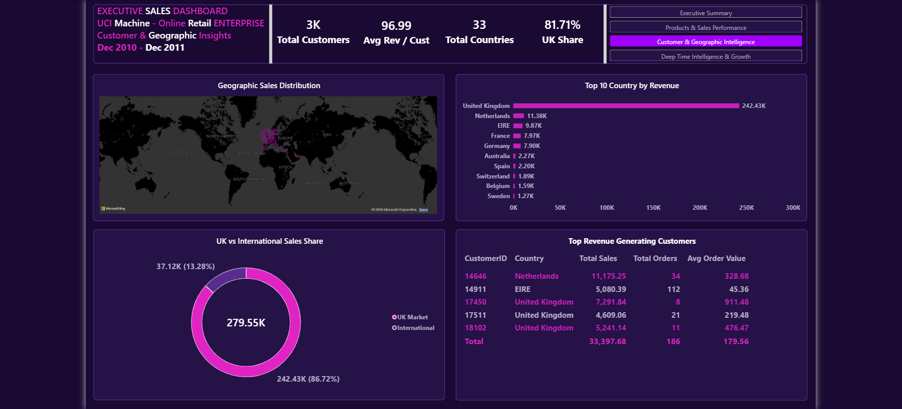
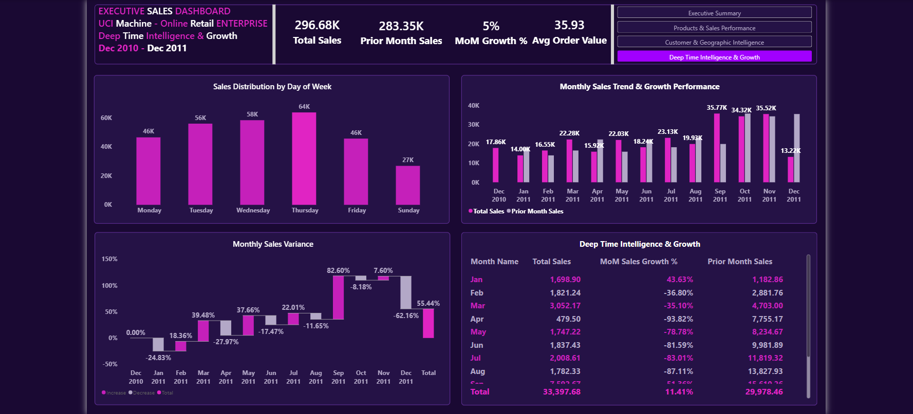

# UCI Online Retail Sales & Customer Intelligence Dashboard

In modern retail environments, raw transactional data often conceals critical business dynamics regarding customer retention, geographic performance, and product contribution margins. Identifying churn risks and cross-region sales fluctuations requires structured dimensional modeling and clear, executive-grade visual hierarchy.

I designed and developed this end-to-end Interactive Sales Analytics Dashboard in Power BI (utilizing the UCI Online Retail dataset) to provide executive leadership and commercial managers with actionable intelligence across sales velocity, customer segmentation, and regional revenue distribution.

---

## Executive Summary & Performance Overview

The primary view aggregates core commercial KPIs to provide a top-level health check of business operations, aligning macro performance metrics with localized regional trends.

* KPI Tracking: Consolidates Total Revenue, Order Volume, Average Order Value (AOV), and Total Active Customers.
* Geographic Breakdown: Maps sales distributions across global markets to highlight key revenue-generating territories and underperforming zones.
* Temporal Trend Analysis: Tracks quarterly and monthly revenue trajectories to identify seasonal purchasing spikes and growth stability.

---

## Key Dashboards Included

### 1. Products & Sales Performance

Delivers granular visibility into product-level mechanics and SKU contribution to drive inventory and promotional strategy.

* SKU Profitability & Volume: Analyzes top-selling products by total revenue vs. volume sold to isolate high-margin driver SKUs.
* Category Contribution: Highlights product category performance, enabling product managers to streamline portfolio offerings.
* Unit Pricing Impact: Evaluates the relationship between price points, order quantities, and overall line-item revenue.

### 2. Customer & Geographic Intelligence

Focuses on customer purchasing behaviors, regional concentration, and client value distribution.

* Client Purchasing Frequency: Identifies high-value enterprise/repeat buyers versus one-off transactional accounts.
* Geographic Heatmaps: Pinpoints geographic clusters of core customer bases to assist in targeted logistics and localized marketing efforts.
* Order Size Distribution: Segments customer accounts based on average transaction size and order frequency.

### 3. Deep Time Intelligence & Growth Trends

Provides time-series analytics and period-over-period comparison metrics using advanced DAX calculations.

* Year-over-Year (YoY) & Month-over-Month (MoM): Tracks transactional growth rates across comparative operational cycles.
* Moving Averages & Velocity: Filters noise from daily sales spikes to establish true revenue run-rates.
* Seasonal Demand Shifts: Assists operational planners in forecasting demand cycles based on historic purchasing patterns.

---

## Strategic Business Value

* Targeted Commercial Execution: Enables marketing and sales leadership to focus customer acquisition efforts on high-LTV geographic zones.
* Product Portfolio Rationalization: Isolates low-margin, high-volume products to optimize pricing structures and inventory management.
* Executive Decision Support: Eliminates manual reporting latency by offering an interactive, single source of truth for cross-departmental reviews.

---

## Data Architecture & Privacy

To maintain strict transactional confidentiality while ensuring enterprise scalability, the underlying analytical model is built using industry-standard enterprise practices:
* Star Schema Modeling: Structured dimensional tables (Customers, Products, Geography, Calendar) surrounding a centralized Transactional Fact Table for optimal query performance.
* Advanced DAX Logic: Standardized calculation logic for Time Intelligence (YoY/MoM), dynamic customer segmentation, and aggregated commercial KPIs.
* Data Anonymization & Privacy: Raw transactional identifiers and sensitivity-prone metrics are anonymized and structured to comply with enterprise data governance standards while preserving full analytical accuracy.
